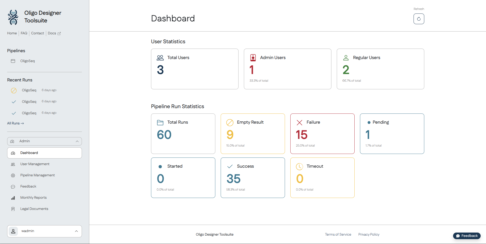
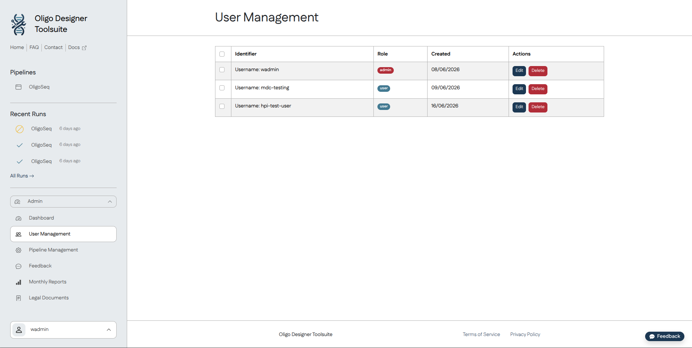
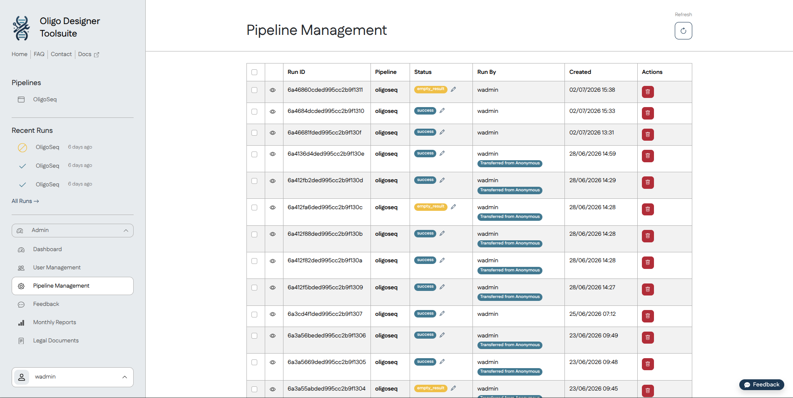
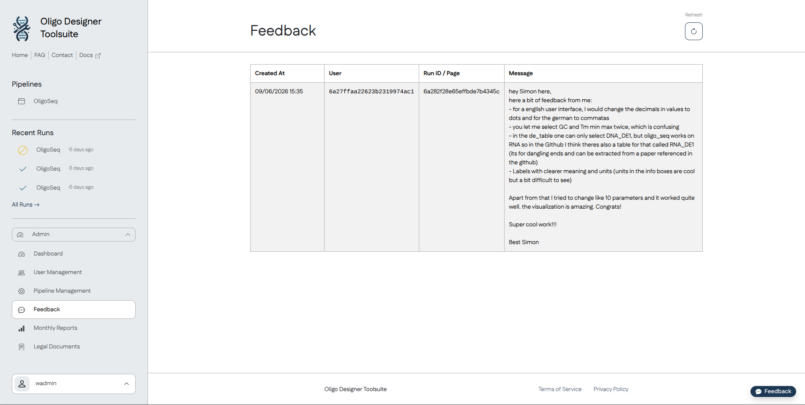
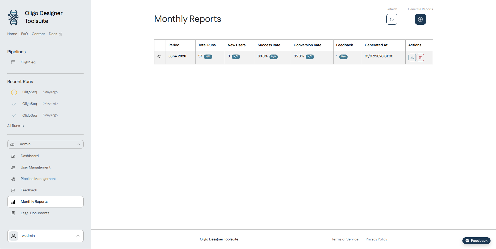
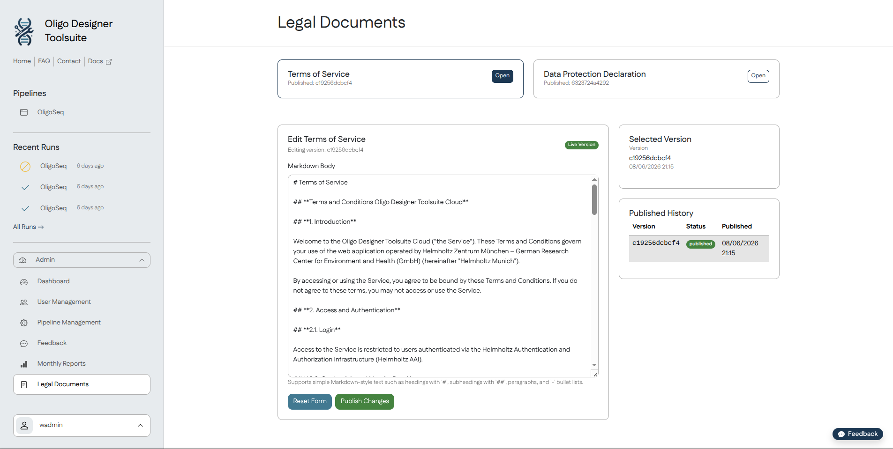

# ODT Cloud: Admin Guide

## Updating ODT Cloud Dependencies

ODT Cloud intentionally does **not** update its dependencies automatically. Dependency updates should be performed manually, reviewed carefully, and validated before being merged. This reduces the risk of introducing unexpected or breaking changes.

It is recommended to update one dependency ecosystem at a time (for example, npm, Python, Docker, or Ansible) to simplify testing and troubleshooting.

#### Dependency locations

| Dependency type            | Files                                                       |
| -------------------------- | ----------------------------------------------------------- |
| Frontend (npm)             | `package.json`                                              |
| Backend (Python)           | `backend/pyproject.toml`                                    |
| Backend Conda environments | `backend/environment.yml`, `backend/worker.environment.yml` |
| External Docker images     | `compose.yml`, `compose.prod.yml`, `compose.override.yml`   |
| Docker base images         | `docker/*.Dockerfile`                                       |
| Ansible                    | `ansible/requirements.in`, `ansible/requirements.yml`       |

#### Updating npm dependencies

Update frontend dependencies using:

```
npm update
```

This updates packages within the version ranges specified in `package.json`.

#### Updating Python dependencies

Update the Python environment using:

```
conda update --all
```

Review any resulting dependency changes and ensure that the repository's dependency declaration files remain up to date.

#### Updating Docker images

Update external Docker images by modifying the image tags in the `compose.yml`, `compose.prod.yml`, and `compose.override.yml` files.

To update Docker base images, modify the `FROM` statements in the `docker/*.Dockerfile` files.

#### Updating Ansible dependencies

Review and update the dependencies declared in:

- `ansible/requirements.in`
- `ansible/requirements.yml`

using the appropriate Ansible tooling for your environment.

---

## Publishing a Release

To publish a new ODT Cloud Docker image:

1. Ensure that all required build variables are configured in `.github/workflows/publish_images.yml`.
2. Create and push a Git tag on the `main` branch via the GitHub UI using the format:

```
v<VERSION>
```

where `<VERSION>` is the semantic version being released, for example:

- `v0.2.0`
- `v0.2.0-alpha.4`

The GitHub Actions workflow will automatically build and publish the Docker image for the new tag.

---

## Deploying ODT Cloud

Deployments are performed using the project's GitHub Actions workflow.

Before starting a deployment:

1. Verify that the Docker image for the desired version has already been published.
2. Ensure all required environment variables are configured in `.github/workflows/deploy_stack.yml`.
3. Ensure all referenced GitHub repository variables and secrets exist and are up to date.
4. Set the GitHub repository variable `ODT_CLOUD_VERSION` to the Docker image tag that should be deployed (for example, `0.2.0-alpha.4`). This tag **must** have been published as a Docker image before.
5. Manually trigger the **Deploy latest ODT Cloud stack** workflow from the GitHub Actions page.

---

## Admin Panel

The Admin Panel is available to users with the **admin** role. After signing in, it can be accessed from the blue navigation menu on the left.

It consists of the following sections.

### Dashboard

The Dashboard provides key statistics on the total amount of users and pipeline runs.



### User Management

The User Management page lists all registered users.

Administrators can:

- edit user information
- delete users
- ban users
- grant or revoke administrator privileges

Deleting a user permanently removes all stored information associated with that account, including pipeline runs. The user may subsequently create a new account using the same Helmholtz OAuth identity.

To permanently prevent account creation using a specific Helmholtz OAuth account, ban the user instead of deleting them.



### Pipeline Management

The Pipeline Management page lists all scheduled and completed pipeline runs.

Administrators can:

- inspect individual runs
- delete pipeline runs and their associated data
- manually update the status of a pipeline run

Deleting a pipeline run that is currently **Scheduled** or **Running** will cancel its execution.



### Feedback

The Feedback page displays all feedback submitted via ODT Cloud's feedback button.

For each submission, ODT Cloud records metadata including:

- the page from which the feedback was submitted
- the associated pipeline run (if applicable)

This information can help reproduce and investigate reported issues.



### Monthly Reports

Monthly Reports provides downloadable CSV reports containing usage statistics. Reports are generated automatically on the first day of each month. Administrators can also manually trigger generation of past reports using the **Generate Reports** action.

An interactive chart at the top of the page visualizes usage trends over time using the reported data.



### Legal Documents

The Legal Documents page is used to manage the:

- Terms of Service
- Data Protection Declaration

Documents are edited using Markdown.

Whenever a document is modified, previous versions are retained by ODT Cloud. This allows administrators to review historical versions or create new revisions based on earlier content when required.



---

## User Management from the Command Line

### Creating Users

When a user signs in using Helmholtz OAuth for the first time, ODT Cloud automatically creates a corresponding user account.

ODT Cloud also includes a legacy username/password authentication system. While this mechanism is expected to be deprecated after the OAuth migration is complete, new users can currently still be created using this command:

```
docker compose exec odt-server micromamba run flask user register
```

Follow the interactive prompts to create the account.

### Granting Administrator Privileges

Existing users can be promoted to administrator through the **User Management** page in the Admin Panel.

Alternatively, administrator privileges can be granted from the command line:

```
docker compose exec odt-server micromamba run flask admin promote "<username-or-helmholtz_sub>"
```

The placeholder `<username-or-helmholtz_sub>` refers either to:

- the legacy system username, or
- the user's Helmholtz OAuth `sub` identifier.

This command must be used to create the **first administrator**, since no user has access to the Admin Panel until at least one administrator exists.
