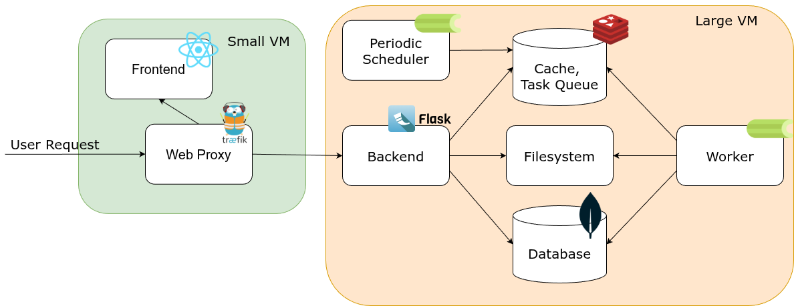

# Architecture

This document summarizes the high-level architecture of ODT-Cloud: the main components, their repository locations, and how they interact. It's a quick orientation for contributors and maintainers.
If you want to contribute to the project please also read the [Contributing Guide](CONTRIBUTING.md).
For more information on how to maintain the project refer to the [Admin Guide](ADMIN_GUIDE.md).

## High-level summary

- Frontend: A React + Vite single-page application that implements the UI and communicates with the backend via HTTP APIs.
- Backend: A Python web service (Flask application) that exposes REST endpoints and coordinates background work. Uses MongoDB for metadata/persistence and Redis for Celery broker/cache.
- Workers: Celery-based background workers for long-running tasks (generation, annotation, pipeline steps). Workers use Redis as the broker/result backend and for transient caches.
- Data & cache: Local data directories for generated artifacts, genomic databases, and caches.
- Database & broker: MongoDB for metadata/persistence; Redis for Celery broker and transient caches.
- Deployment: Containerised with Docker; orchestrated via `docker-compose` and optionally provisioned with Ansible; `nginx` is used as a reverse proxy in production.
  

## Components and locations

- **Frontend (UI)**: [`src/`](src/)
  - Entrypoints: [`src/index.tsx`](src/index.tsx), [`src/App.tsx`](src/App.tsx)
  - Tests & e2e: [`src/tests/`](src/tests/), [playwright tests](tests/e2e/).
  - Purpose: User-facing SPA built with React + TypeScript and bundled with Vite. Handles client routing, forms, validation and UX for pipeline configuration. Also adds the admin interface for monitoring and user management.

- **Backend (API & Core logic)**: [`backend/`](backend/)
  - Entrypoints: [`backend/app.py`](backend/app.py), [`backend/cli.py`](backend/cli.py)
  - Key modules: [`backend/config.py`](backend/config.py), [`backend/extensions.py`](backend/extensions.py), [`backend/cache.py`](backend/cache.py), [`backend/utils.py`](backend/utils.py)
  - Data/schema helpers: [`backend/genomic_databases.py`](backend/genomic_databases.py), [`backend/annotation_cache/`](backend/annotation_cache/)
    -Tests: [`backend/tests/`](backend/tests/)
  - Purpose: Hosts HTTP API, performs validation, orchestrates tasks and persistence, exposes administrative CLI helpers.

- **Workers & Scheduling**: [`backend/beat/`](backend/beat/) and [`worker/`](backend/worker/)
  - Celery: [`backend/beat/celery.py`](backend/beat/celery.py)
  - Purpose: Runs asynchronous jobs and scheduled tasks (e.g., background generation, annotation refreshes).

- **Infrastructure services**:
  - **MongoDB**: Primary document database used for metadata and persistence (see [`backend/config.py`](backend/config.py)). In [`compose.yml`](compose.yml) this is provided by the `odt-db` service.
  - **Redis**: Used as the Celery broker/result backend and for transient caches (see [`backend/config.py`](backend/config.py)). In [`compose.yml`](compose.yml) this is provided by the `odt-redis` service.

- **Data, caches and generated artifacts**: [`backend/data/`](backend/data/), [`backend/cache/`](backend/cache/)
  - Contains: generated oligoseq results, annotation caches, genomic regions and other runtime artifacts.

- **Schemas & Validation**: [`schemas/`](schemas/)
  - JSON schemas used to validate pipeline inputs and forms (e.g., [`oligoseq.schema.json`](schemas/oligoseq.schema.json)).

- **Deployment & DevOps**: top-level files and folders
  - Dockerfiles: [`docker/`](docker/)
  - Compose: [`compose.yml`](compose.yml) and environment-specific overrides like [`compose.prod.yml`](compose.prod.yml) and [`compose.override.yml`](compose.override.yml). The compose configuration defines named volumes `data-access` and `cache` for persistent artifacts and cache storage.
  - Reverse proxy: [`nginx.conf`](nginx.conf) for production proxying and static-serving.
  - Provisioning: [`ansible/`](ansible/) contains playbooks and inventory for cloud provisioning and deployment automation.

- **Observability**:
  - [`monitoring/`](monitoring/) contains Prometheus and Grafana configs for metrics and dashboards.
  - Logging: backend logs to stdout (collected by container runtime); consult [`backend/config.py`](backend/config.py) for log level configuration.

- **Testing and Verification**:
  - Unit ([`backend/tests/`](backend/tests/)) & integration ([`src/tests/`](src/tests/)) tests.
  - End-to-end: [`tests/e2e/`](tests/e2e/) folder for browser scenarios.

## Data flow (high level)

1. User interacts with the frontend SPA and submits a request.
2. Frontend sends an HTTP request to the backend API.
3. Backend validates input using JSON schemas in [`schemas/`](schemas/) and either:

- Responds synchronously with small results, or
- Enqueues a background job (via Celery) and returns a job id/status endpoint.

4. Workers pick up tasks, write artifacts to [`backend/data/`](backend/data/) or caches in [`backend/cache/`](backend/cache/), and update job status.
5. Frontend polls or receives updates to surface job progress and fetch generated artifacts.

## Where to go next

- Read the [`docs/`](docs/) for user and developer docs, design notes and operational runbooks.
