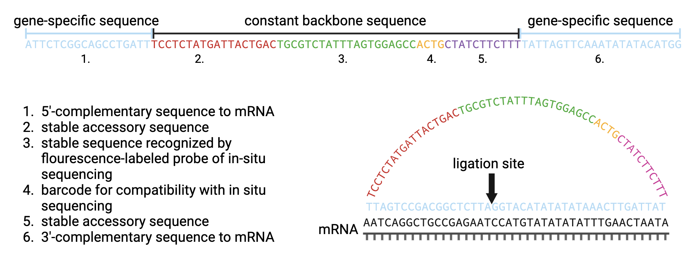
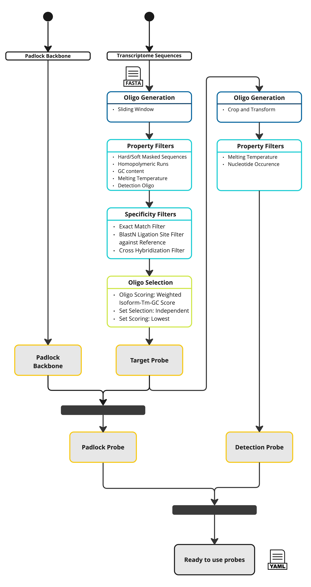

# SCRINSHOT

Padlock probes are short single-stranded oligos designed to bind a target sequence at both their 5′ and 3′ ends. Once hybridized, the probe’s ends are ligated to form a circular molecule that can then be amplified or visualized in situ. Scrinshot (Single-Cell RNA In-Situ Hybridization and Sequencing On Tissue) uses these padlock probes to detect and quantify specific RNA transcripts at single-cell resolution, enabling highly multiplexed and spatially resolved gene expression analysis.

Padlock probes contain two variable gene-specific 5’- and 3’- arms and a stable backbone sequence of 53 nucleotides (nt) which is subdivided in four parts. Circularized padlock probe is hybridized to the complementary sequence of the corresponding mRNA

## Pipeline Description

The pipeline has four major steps:

- Probe generation (dark blue)
- Probe filtering by sequence property and binding specificity (light blue)
- Probe set selection for each gene (green)
- Final probe sequence generation (yellow)

For the probe generation step, the user has to provide a FASTA file with genomic sequences which is used as reference for the generation of probe sequences. The probe sequences are generated using the OligoSequenceGenerator. Therefore, the user has to define the probe length (can be given as a range), and optionally provide a list of gene identifiers (matching the gene identifiers of the annotation file) for which probes should be generated. If no gene list is given, probes are generated for all genes in the reference. The probe sequences are generated in a sliding window fashion from the DNA sequence of the non-coding strand, assuming that the sequence of the coding strand represents the target sequence of the probe. The generated probes are stored in a FASTA file, where the header of each sequence stores the information about its reference region and genomic coordinates. In a next step, this FASTA file is used to create an OligoDatabase, which contains all possible probes for a given set of genes. When the probe sequences are loaded into the database, all probes of one gene having the exact same sequence are merged into one entry, saving the transcript, exon and genomic coordinate information of the respective probes.

In the second step, the number of probes per gene is reduced by applying different sequence property (PropertyFilter) and binding specificity filters (SpecificityFilter). For the SCRINSHOT protocol, the following sequence property filters are applied: removal of probes that contain unidentified nucleotides (HardMaskedSequenceFilter), that contain low-complexity region like repeat regions (SoftMaskedSequenceFilter), that have a GC content (GCContentFilter) or melting temperature (MeltingTemperatureNNFilter) outside a user-specified range, that contain homopolymeric runs of any nucleotide longer than a user-specified threshold (HomopolymericRunsFilter), that cannot form valid detection oligos (DetectionOligoFilter). After removing probes with undesired sequence properties from the database, the probe database is checked for probes that potentially cross-hybridize, i.e. probes from different genes that have the exact same or similar sequence. Those probes are removed from the database to ensure uniqueness of probes for each gene. Cross-hybridizing probes are identified with the CrossHybridizationFilter that uses a BlastN alignment search to identify similar sequences and removes those hits with the RemoveByBiggerRegionPolicy that sequentially removes the probes from the genes that have the bigger probe sets. Next, the probes are checked for off-target binding with any other region of a provided background reference. Off-target regions are sequences of the background reference (e.g. transcriptome or genome) which match the probe region with a certain degree of homology but are not located within the gene region of the probe. Those off-target regions are identified with the BlastNSeedregionLigationsiteFilter that removes probes where a BlastN alignment search found off-target sequence matches with a certain coverage and similarity, for which the user has to define thresholds. The coverage of the region around the ligation site of the probe by the matching off-target sequence is used as an additional filtering criterion.

In the third step of the pipeline, the best sets of non-overlapping probes are identified for each gene. The OligosetGeneratorIndependentSet class is used to generate ranked, non-overlapping probe sets where each probe and probe set is scored according to a protocol dependent scoring function, i.e. by the distance to the optimal GC content and melting temperature, weighted by the number of targeted transcripts of the probes in the set. Following this step all genes with insufficient number of probes (user-defined) are removed from the database and stored in a separate file for user-inspection.

In the last step of the pipeline, the ready-to-order probe sequences containing all additional required sequences are designed for the best non-overlapping sets of each gene. For the SCRINSHOT protocol, the padlock backbone is added to each probe and for each probe a detection oligo is created, by cropping the probe with even nucleotide removal from both ends, exchanging Thymines to Uracils, and placing the fluorescent dye at the side with the closest Uracil.

All default parameters can be found in the [`scrinshot_probe_designer.yaml`](https://github.com/HelmholtzAI-Consultants-Munich/oligo-designer-toolsuite/blob/main/data/configs/scrinshot_probe_designer.yaml) config file provided along the repository.
